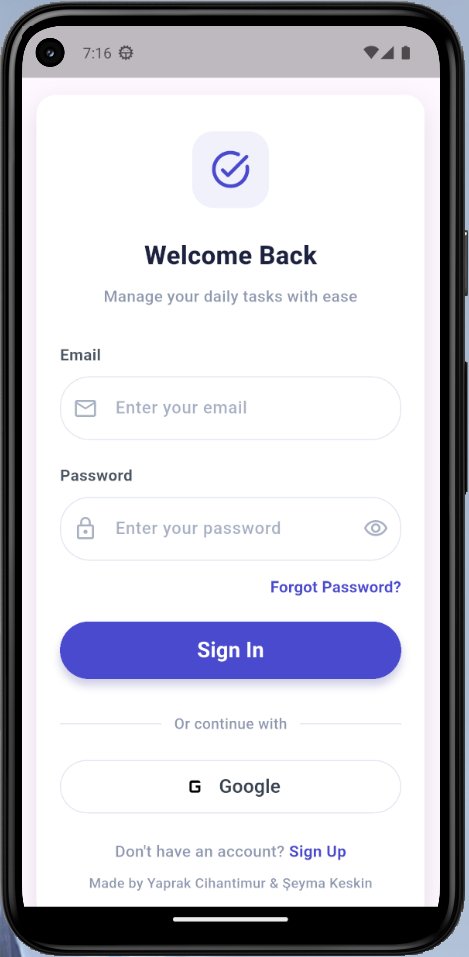
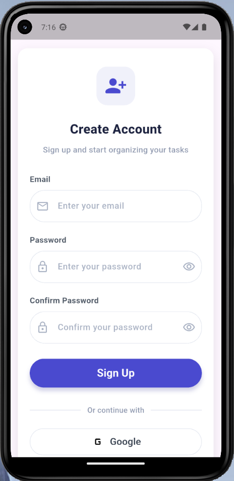
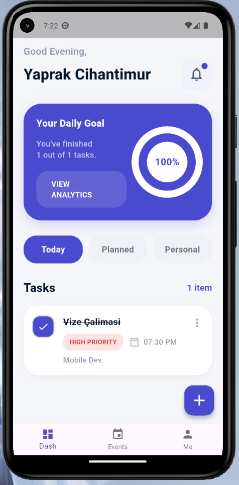
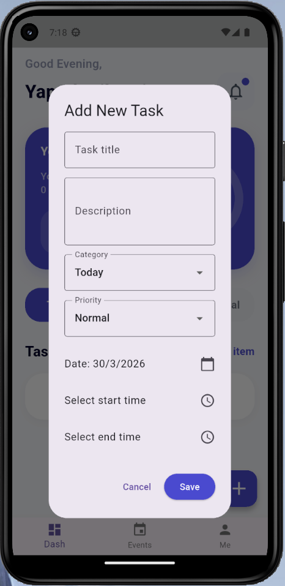
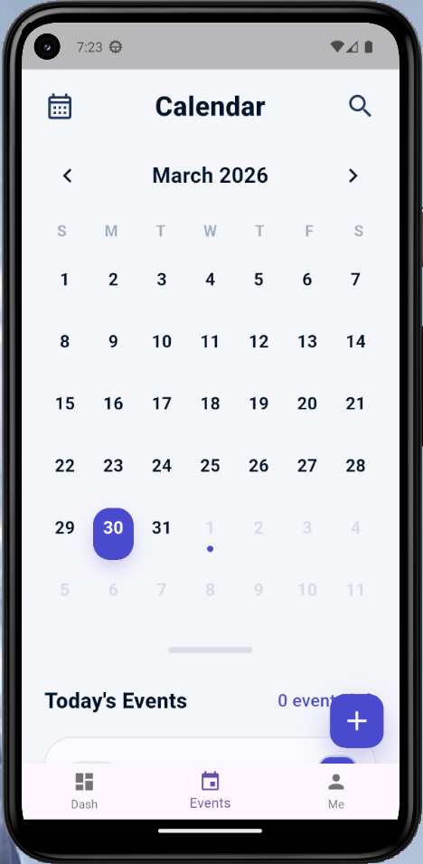
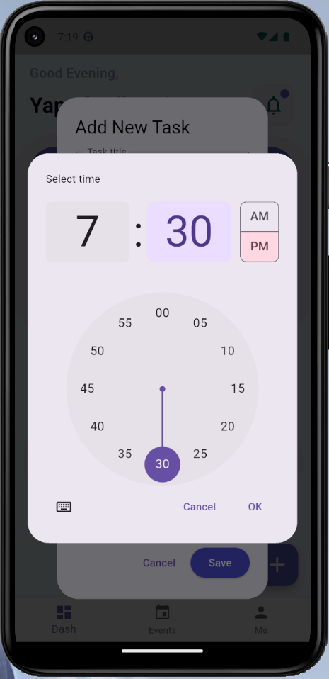
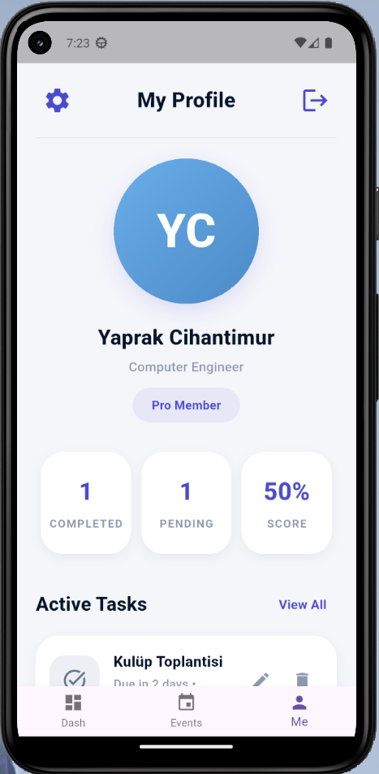

# To Do App

To Do App, kullanıcıların günlük ve planlanmış işlerini düzenli bir şekilde takip edebilmesi için geliştirilmiş bir görev yönetim uygulamasıdır. Kullanıcılar hesap oluşturabilir, giriş yapabilir ve yalnızca kendilerine ait görevleri oluşturup görüntüleyebilir, güncelleyebilir ve silebilir.

Uygulama, Flutter kullanılarak Dart dili ile geliştirilmiştir. Kimlik doğrulama işlemleri Firebase Authentication ile, görev verilerinin saklanması ise Firebase Realtime Database ile sağlanmaktadır.

## Özellikler

- Kayıt olma
- Giriş yapma
- Çıkış yapma
- Görev ekleme
- Görev güncelleme
- Görev silme
- Görevleri listeleme
- Tamamlandı / tamamlanmadı durumu
- Tarih bilgisi
- Saat bilgisi
- Öncelik seviyesi
- Kategori seçimi
- Kullanıcıya özel veri yönetimi
- Kalıcı veri saklama
- CRUD işlemleri

## Kullanılan Teknolojiler

- **Flutter**
- **Dart**
- **Firebase Authentication**
- **Firebase Realtime Database**
- **setState**

## Proje Yapısı

```text
lib/
├── models/
│   └── task_model.dart
├── screens/
│   ├── dash_screen.dart
│   ├── events_screen.dart
│   ├── home_screen.dart
│   ├── login_screen.dart
│   ├── me_screen.dart
│   └── register_screen.dart
├── services/
│   ├── auth_service.dart
│   └── task_service.dart
├── widgets/
│   └── custom_text_field.dart
├── firebase_options.dart
└── main.dart
```
Uygulama Akışı;

Login Screen: Kullanıcı giriş ekranı

Register Screen: Yeni kullanıcı kayıt ekranı

Dash Screen: Günlük hedef ve görev özetlerinin gösterildiği ana ekran

Events Screen: Takvim ve planlanan görevlerin görüntülendiği ekran

Me Screen: Kullanıcı profil ve görev durum bilgilerinin yer aldığı ekran


## Screens

<p align="center">
  
  
  
</p>

<p align="center">
  
  
  
</p>

<p align="center">
  
</p>

Kurulum:

Projeyi kendi bilgisayarınızda çalıştırmak için aşağıdaki adımları uygulayın:

1. Repoyu klonlayın
git clone https://github.com/codelyth/to-do-app.git
cd to-do-app

2. Gerekli paketleri yükleyin
flutter pub get

3. Firebase yapılandırmasını tamamlayın
Bu proje Firebase kullanmaktadır. Uygulamayı çalıştırmadan önce:
Firebase projesi oluşturun
Android için yapılandırma dosyasını alın
"google-services.json" dosyasını uygun klasöre ekleyin.
Not: Firebase bağlantısı olmadan uygulamanın kimlik doğrulama ve veri işlemleri çalışmaz.

4. Uygulamayı başlatın
flutter run

Veri Saklama ve Kullanıcı Yapısı:

Her kullanıcıya özel bir uid tanımlanır
Kullanıcının görevleri bu kimliğe bağlı olarak saklanır
Kullanıcı hesabını silmediği sürece görev verileri güncel haliyle veritabanında tutulur
Her kullanıcı yalnızca kendi görevlerine erişebilir

Güvenlik:

kullanıcılar yalnızca kendi verilerine erişir
erişim uid bazlı ayrıştırılır
kimlik doğrulama Firebase Authentication ile yapılır
veriler Firebase Security Rules ile korunur

Desteklenen Platformlar:

Android
Windows

Geliştiriciler: Şeyma Keskin & Yaprak Cihantimur

Bu proje, görev yönetimi ve kullanıcıya özel veri saklama mantığını öğrenmek ve uygulamak amacıyla geliştirilmiştir. Flutter ile mobil arayüz geliştirme, Firebase ile kimlik doğrulama ve gerçek zamanlı veri yönetimi konularında pratik bir örnek sunar.