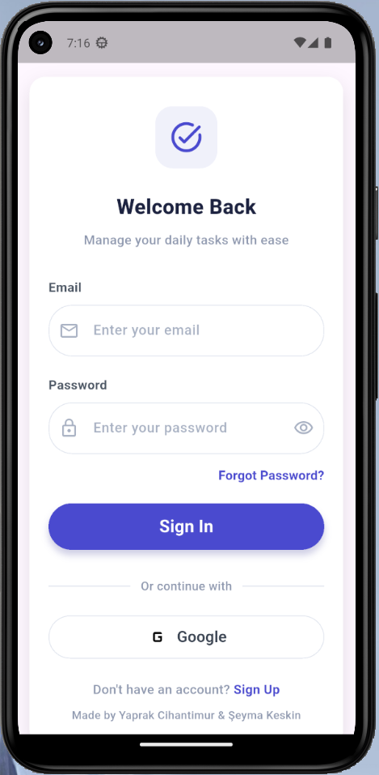
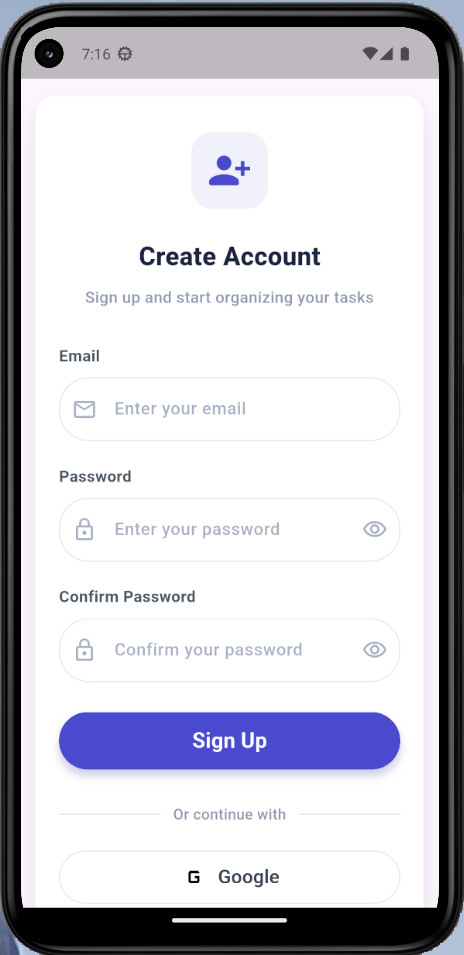
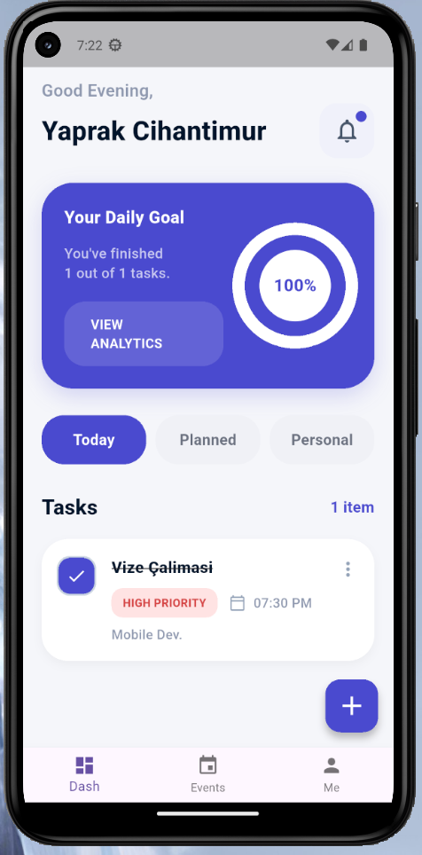
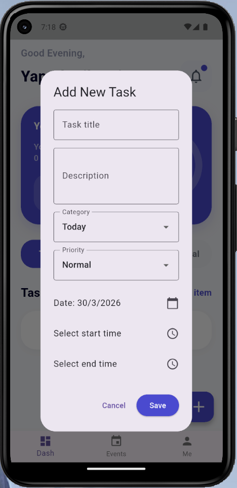
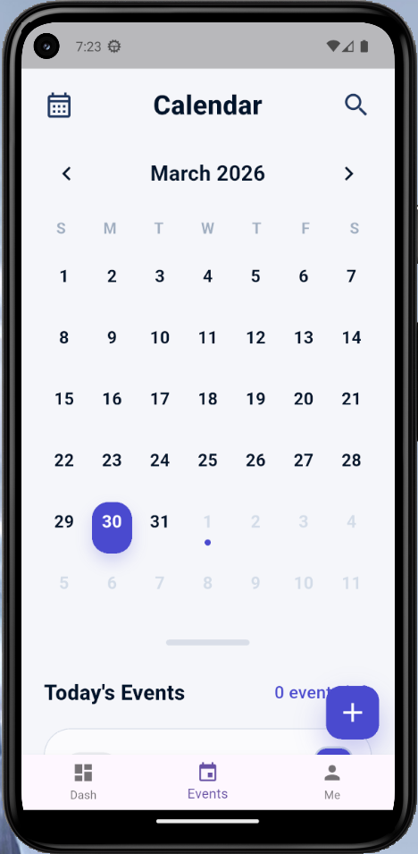
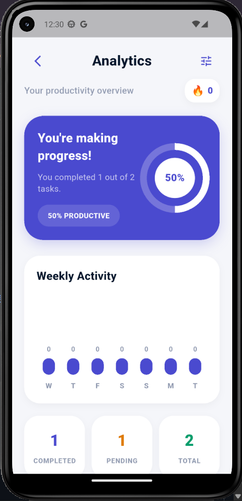
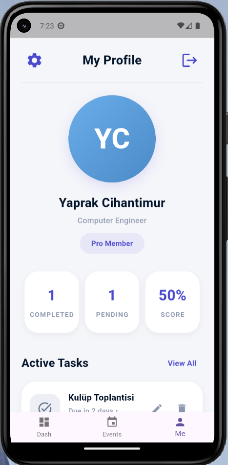

# To Do App 💙

To Do App is a modern task management application developed to help users organize and track their daily and planned tasks efficiently. Users can create an account, log in securely, and manage only their own tasks with real-time synchronization.

The application is developed using **Flutter** and **Dart**. Authentication operations are handled with **Firebase Authentication**, while task and user data are stored using **Cloud Firestore**.

The project features a clean and minimal UI inspired by modern productivity applications, including analytics, task categorization, calendar management, and personalized user profiles.

---

# ✨ Features

## Authentication
- Email & Password Sign Up
- Email & Password Login
- Google Sign In
- Logout
- Firebase Authentication integration

## Task Management
- Add new tasks
- Edit tasks
- Delete tasks
- Mark tasks as completed
- Real-time task updates
- User-specific task management
- Persistent cloud storage
- CRUD operations

## Task Details
- Task title
- Description
- Date selection
- Time selection
- Priority levels
- Category selection
- Planned / Personal / Today filtering

## Profile System
- Editable profile information
- User-specific profile data
- Google profile integration
- Task statistics overview

## Analytics System 📊
- Productivity score
- Weekly activity graph
- Completed / pending statistics
- Category breakdown
- Streak tracking system
- Dynamic motivational messages

---

# 🛠 Technologies Used

- **Flutter**
- **Dart**
- **Firebase Authentication**
- **Cloud Firestore**
- **Google Sign In**
- **Firebase Security Rules**
- **setState**
- **StreamBuilder**
- **CustomPainter**

---

# 📁 Project Structure

```text
lib/
├── models/
│   └── task_model.dart
│
├── screens/
│   ├── analytics_screen.dart
│   ├── dash_screen.dart
│   ├── events_screen.dart
│   ├── home_screen.dart
│   ├── login_screen.dart
│   ├── me_screen.dart
│   └── register_screen.dart
│
├── services/
│   ├── auth_service.dart
│   └── task_service.dart
│
├── widgets/
│   └── custom_text_field.dart
│
├── firebase_options.dart
└── main.dart
```

---

# 📱 Application Flow

## Login Screen
Secure user authentication screen.

## Register Screen
New account creation screen.

## Dash Screen
Main productivity dashboard displaying:
- Daily goals
- Active tasks
- Progress indicators
- Analytics shortcut

## Events Screen
Calendar-based task management and planned events view.

## Analytics Screen
Advanced productivity analysis page including:
- Weekly activity graph
- Productivity score
- Task statistics
- Category breakdown
- Streak tracking

## Me Screen
Profile management page displaying:
- User information
- Task statistics
- Editable profile settings
- Active tasks overview

---

# 📸 Screens

<p align="center">
  
  
  
</p>

<p align="center">
  
  
  
</p>

<p align="center">
  
</p>

---

# ⚙️ Installation

To run this project on your local machine, follow these steps:

## 1. Clone the repository

```bash
git clone https://github.com/codelyth/to-do-app.git

cd to-do-app
```

---

## 2. Install dependencies

```bash
flutter pub get
```

---

## 3. Configure Firebase

This project uses Firebase services.

Before running the application:

- Create a Firebase project
- Enable Authentication
- Enable Google Sign In
- Create a Cloud Firestore database
- Add Android application to Firebase
- Download `google-services.json`
- Place it inside:

```text
android/app/
```

---

## 4. Configure FlutterFire

Run:

```bash
flutterfire configure
```

---

## 5. Run the application

```bash
flutter run
```

---

# ☁️ Data Management

- Every user is assigned a unique `uid`
- Tasks are stored based on the authenticated user
- Users can only access their own data
- Task and profile data are stored securely in Firestore
- Real-time synchronization is supported

---

# 🔐 Security

- Firebase Authentication is used for identity verification
- Firestore Security Rules protect user data
- UID-based access control is implemented
- Users can only read/write their own documents

Example rule logic:

```javascript
allow read, write: if request.auth != null
&& request.auth.uid == userId;
```

---

# 📊 Analytics System

The analytics page dynamically calculates:

- Weekly productivity
- Completed task percentage
- Pending tasks
- Category distribution
- Daily streaks
- Progress-based motivational messages

All analytics are generated in real time using Firestore data streams.

---

# 🎨 UI Design

The application follows a:
- Minimal
- Modern
- Soft productivity UI

design language inspired by modern productivity apps.

Main theme:
- Soft purple tones
- Rounded cards
- Smooth spacing
- Clean typography

---

# 📦 Supported Platforms

- Android
- Windows

---

# 👩‍💻 Developers

- **Şeyma Keskin**
- **Yaprak Cihantimur**

---

# 📚 Purpose of the Project

This project was developed to practice and demonstrate:

- Flutter mobile UI development
- Firebase Authentication
- Cloud Firestore integration
- Real-time database operations
- User-specific data management
- Modern productivity app design principles

It also serves as a practical example of building a complete full-stack Flutter application using Firebase services.
